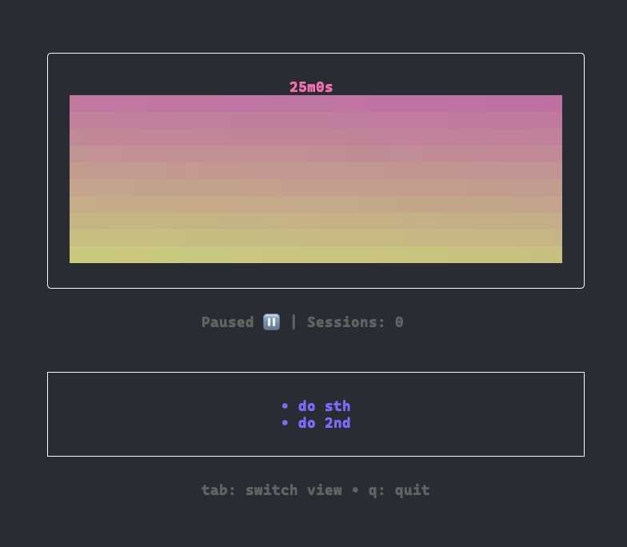

# Pom - Customizable Pomodoro Timer

A beautiful terminal-based pomodoro timer built with [Bubble Tea](https://github.com/charmbracelet/bubbletea), featuring gradient progress bars and todo list functionality.



## Features

- 🍅 **Customizable session durations** - Set work, short break, and long break times
- 🌈 **Gradient progress bars** - Visual sand timer that drains from top-right to bottom-left
- 📝 **Todo list integration** - Track tasks during your pomodoro sessions
- ⚡ **Automatic transitions** - Seamlessly flow between work and break sessions
- 🎨 **Configurable display** - Adjust the number of progress bar lines
- 💾 **Persistent storage** - Todo lists are saved per directory

## Installation

```bash
go install github.com/emshan/pom@latest
```

Or clone and build:

```bash
git clone https://github.com/emshan/pom.git
cd pom
go build -o pom
```

## Usage

### Basic Usage

```bash
# Default 25-minute work session
pom

# Custom 45-minute work session
pom -s 45m

# Custom work and break durations
pom -s 30m -sb 10m -lb 20m

# Customize progress bar lines
pom -s 25m -l 10
```

### Command Line Options

- `-s` - Session (work) duration (default: 25m)
- `-sb` - Short break duration (default: 5m) 
- `-lb` - Long break duration (default: 15m)
- `-l` - Number of progress bar lines (default: 5)

### Controls

- `Space` - Start/pause timer
- `r` - Reset current session
- `Tab` - Switch between timer and todo views
- `q` - Quit

### Todo List Controls

- `a` - Add new todo
- `e` - Edit selected todo
- `Enter` - Toggle todo completion
- `d` - Delete selected todo
- `Esc` - Cancel add/edit mode

## How It Works

The timer follows the traditional Pomodoro Technique:

1. **Work** → Short Break
2. **Work** → Short Break  
3. **Work** → Short Break
4. **Work** → **Long Break**
5. Cycle repeats...

The progress bars show a beautiful gradient from pink (#FF7CCB) to yellow (#FDFF8C), visually representing time remaining as a draining sand timer.

## Examples

```bash
# Study session with longer breaks
pom -s 50m -sb 15m -lb 30m

# Quick sprints with fine-grained progress
pom -s 15m -l 15

# Writing session with extended long breaks
pom -s 45m -lb 25m
```

## Built With

- [Bubble Tea](https://github.com/charmbracelet/bubbletea) - Terminal UI framework
- [Bubbles](https://github.com/charmbracelet/bubbles) - UI components
- [Lipgloss](https://github.com/charmbracelet/lipgloss) - Styling and layout

## License

MIT License - see LICENSE file for details.
